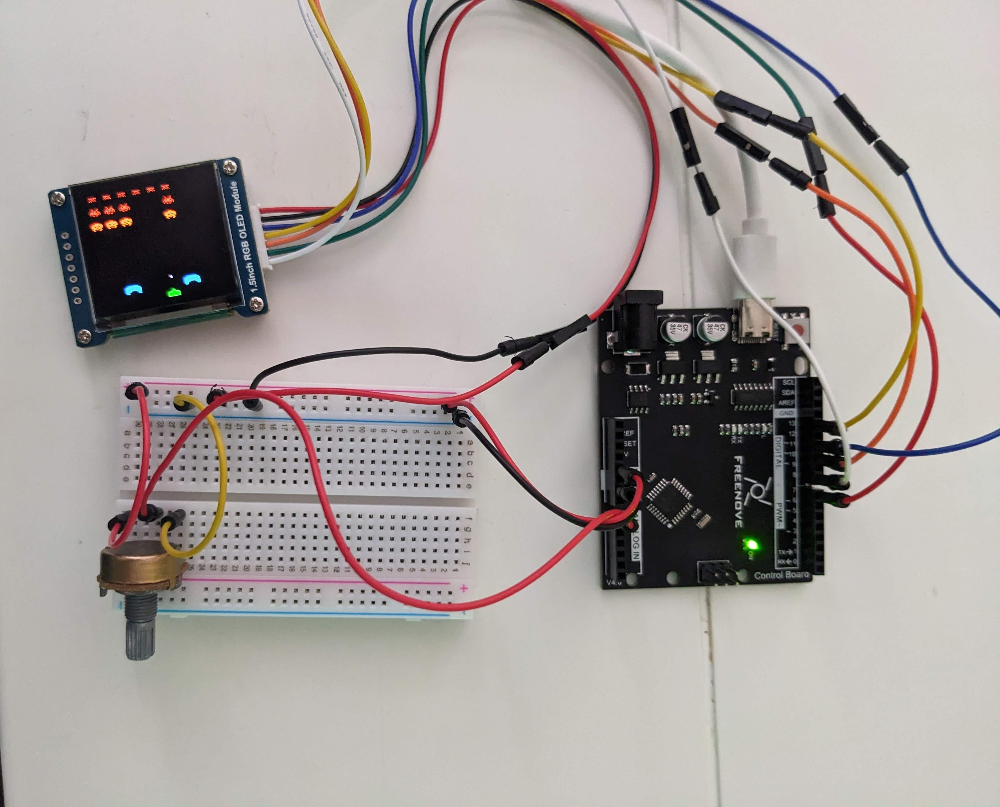

# Space-Invaders
This is a Space Invaders game developed for Arduino

All configuration settings are located at the beginning of the file. Player movement is facilitated by a potentiometer-based controller.

When utilizing my screen (using the 1351 driver), I've observed flickering issues stemming from the absence of a writable buffer. Consequently, I lack the capability to compose an image off-screen and subsequently transmit it to the display. As a result, the screen refreshes each time even the smallest pixel adjustment occurs. This concern should be mitigated when operating on a screen equipped with a functional buffer.

